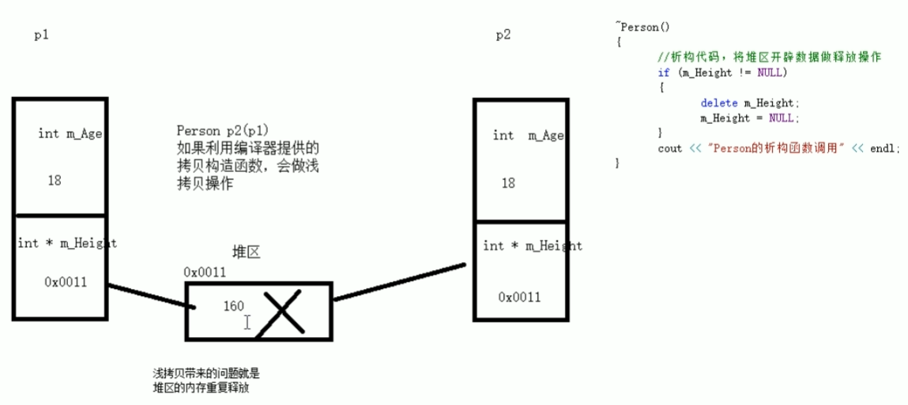

### 类和对象

C++面向对象的三大特性：**封装、继承、多态**

#### 封装

- 将属性和行为作为一个整体
- 将属性和行为加以权限控制

```c++
class Student
{
private:
    string name;
    int age;
public:
    // 通过公共接口访问私有属性
    void setInfo(string name1,int age1){
        name=name1;
        age=age1;
    }
    void showInfo(){
        cout<<"Name:"<<name<<"\t"<<"Age:"<<age<<endl;
    }
};


int main(){
    // 创建对象
    Student s1;
    // 给对象赋值
    s1.setInfo("Mike",18);
    s1.showInfo();
    
    return 0;
}
```

> 类中的属性和行为统一称为 成员
>
> 属性—成员属性、成员变量
>
> 行为—成员函数、成员方法

#### 访问权限

公共权限 public：  成员 **类内可以访问，类外可以访问**

保护权限 protect：成员 **类内可以访问，类外不可以访问，子类继承可以访问**

私有权限 private：成员 **类内可以访问，类外不可以访问，子类继承不可访问**

##### struct和class区别

- struct默认权限是public
- class默认权限是private


#### 对象的初始化和清理

##### 构造函数和析构函数

对象的**初始化**和**清理**是两个非常重要的安全问题

- 一个对象或者变量没有初始状态，对其使用后果是未知的
- 同样用完一个对象或成员变量，没有及时清理，也会造成一定的安全问题

C++利用**构造函数**和**析构函数**解决上述问题，这两个函数会被编译器自动调用，完成对象的初始化和清理工作。如果我们不提供构造和析构，编译器会提供编译器提供的构造函数和析构函数的空实现。

- 构造函数：主要作用在于创建对象时为对象的成员属性赋值，由**编译器自动调用**
- 析构函数：主要作用在于对象的**销毁前**系统自动调用，执行一些清理工作

**构造函数语法：**`类名(){}`

1. 没有返回值也不写void
2. 可以有参数，可以发生重载

**析构函数语法：**`~类名(){}`

1. 没有返回值也不写void
2. 加上 ~
3. 不可以有参数，不能发生重载

```c++
class Person
{
private:
    string name;
    int age=0;
public:
    void setInfo(string name1,int age1){
        name=name1;
        age=age1;
    }
    // 构造函数和析构函数的声明
    Person(/* args */);
    ~Person();
};
Person::Person(/* args */)
{
    cout<<"Person is invoked."<<endl;
}
Person::~Person()
{
    cout<<"~Person is invoked."<<endl;
}

int main(){
    Person p;
    p.setInfo("Mike",18);
    return 0;
}
```

##### 构造函数的分类及调用

 有参构造、无参构造、拷贝构造

```C++
class Person
{
private:
    string name;
    int age=0;
public:
    void setInfo(string name1,int age1){
        name=name1;
        age=age1;
    }
    // 构造函数和析构函数的声明
    Person();                 // 无参构造
    Person(string n,int a);            // 有参构造
    Person(const Person &p);  // 拷贝构造
    ~Person();                // 析构函数
};
// 无参构造
Person::Person()
{
    cout<<"无参构造调用"<<endl;
}
// 有参构造
Person::Person(string n,int a)
{
    name=n;
    age=a;
    cout<<"有参构造调用"<<endl;
}
// 拷贝构造
Person::Person(const Person &p)
{
    name=p.name;
    age=p.age;
    cout<<"拷贝构造调用"<<endl;
}
// 析构函数
Person::~Person()
{
    cout<<"析构函数调用"<<endl;
}

int main(){
    system("chcp 65001");

    Person p1;
    p1.setInfo("Mike",18);
    Person p2("Alice",19);
    // 第二种写法:Person p2=Person("Alice",19)
    Person p3(p1);
    // 第二种写法:Person p3=Person(p1)
    // 第三种写法:Person p3=p1
    
    Person("Jack",20);  // 匿名对象 当前执行结束后，系统会立即回收掉匿名对象
    // Person(p3) // Person(p3)等价于Person p3; 不要用匿名对象定义拷贝构造
    return 0;
}
```

##### 拷贝构造函数的调用时机

C++中拷贝构造函数的调用时机通常有3种情况

- 使用一个以及创建完毕的对象来初始化一个新对象
- 值传递的方式给函数参数传值
- 以值方式返回局部对象

##### 构造函数的调用规则

创建一个类，编译器会给每个类都添加至少3个函数

1. 默认构造函数（空实现）
2. 析构函数（空实现）
3. 拷贝构造（**值拷贝，即拷贝全部属性值给新对象**）

> 注意：
>
> 如果用户定义**有参构造**，编译器**不会**提供**默认的无参构造**，**会**提供**默认拷贝构造**
>
> 如果用户定**拷贝构造**，编译器**不会**提供**其他构造函数**

##### 深拷贝和浅拷贝（面试经典问题）

- 浅拷贝：简单的赋值拷贝操作
- 深拷贝：在堆区重新申请空间，进行拷贝操作

```c++
class Person
{
private:
    int id;
    int *age;  // 要开辟到堆区，所以定义指针
public:
    Person(int id1,int age1);
    Person(const Person &p);
    ~Person();
};

Person::Person(int id1,int age1)
{
    id=id1;
    age=new int(age1);  // 存放在堆区
    cout<<"有参构造调用"<<endl;
}
// 自定义拷贝构造，深拷贝
Person::Person(const Person &p)
{
    id=p.id;
    // age=p.age; // 编译器默认实现,浅拷贝
    age=new int(*p.age);  // 深拷贝
    cout<<"拷贝构造调用"<<endl;
}
Person::~Person()
{
    // 堆区内存释放
    if (age!=NULL)
    {
        delete age;
    }
    cout<<"析构函数调用"<<endl;
}

int main(){
    system("chcp 65001");

    Person p1(001,18);

    Person p2(p1);
}
```

##### 浅拷贝带来的问题



会造成内存的重复释放，因为指针的地址也拷贝过去，两个对象指向同一块内存。这种情况要自己定义拷贝构造函数

##### 初始化列表

**语法：**`类名():属性1(值1),属性2(值2),...{}`

```c++
class Person
{
private:
    int id;
    int *age;  // 要开辟到堆区，所以定义指针
public:
    Person():id(000),age(new int(00)){} // 无参初始化
    Person(int id1,int age1):id(id1),age(new int(age1)){} // 有参初始化
    Person(const Person &p);
    ~Person();
};
```

> id(id1)等价于id=id1；age(new int(age1)等价于age=new int(age1);