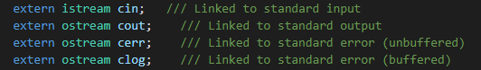

### 友元

```c++
class goodGay
{
    ...
}
class Building
{
    // 告诉编译器，goodGay是全局函数，是Building类的好朋友，可以访问私有内容
    friend void goodGay(Building *b);
    // friend修饰类
    friend class goodGay;
    // friend修饰其他类的成员函数
    friend void goodGay::visit();
private:
    string SittingRoom;
    string BedRoom;
public:
    Building();
    ~Building();
};

Building::Building()
{
    this->SittingRoom="Sitting Room";
    this->BedRoom="Bed Room";
}
Building::~Building()
{
}

void goodGay(Building *b){
    cout<<b->BedRoom<<endl;
    cout<<b->SittingRoom<<endl;
}

int main(){
    Building b;
    goodGay(&b);
}
```

#### 运算符重载

```c++
#include<iostream>
using namespace std;

class Vector
{
    friend Vector operator-(Vector &v1,Vector &v2);
    friend ostream &operator<<(ostream &cout, Vector v);
    friend Vector &operator++(Vector &v);
    friend Vector operator++(Vector &v,int);
private:
    int num1;
    int num2;
public:
    Vector(int num1,int num2);
    ~Vector();
    // 通过成员函数重载运算符 +
    Vector operator+(Vector &v){
        Vector temp(0,0);
        temp.num1=this->num1+v.num1;
        temp.num2=this->num2+v.num2;
        return temp;
    }
    // 成员函数重载后置++
    /*Vector operator++(int){
        Vector temp=*this;
        this->num1++;
        this->num2++;
        return temp;
    }*/
    void show(){
        cout<<this->num1<<"\t"<<this->num2<<endl;
    }
};

Vector::Vector(int num1,int num2)
{
    this->num1=num1;
    this->num2=num2;
}
Vector::~Vector(){}

// 通过全局函数重载运算符 -
Vector operator-(Vector &v1,Vector &v2){
    Vector temp(0,0);
    temp.num1=v1.num1-v2.num1;
    temp.num2=v1.num2-v2.num2;
    return temp;
}
// 左移运算符重载
// v前面不要加&，目的是为了后置++重载时，返回的是一个临时变量，引用不能指向临时变量
ostream &operator<<(ostream &cout, Vector v){
    cout<<v.num1<<"\t"<<v.num2<<endl;
    return cout;
}
/*void operator<<(ostream &cout, Vector &v){
    cout<<v.num1<<"\t"<<v.num2<<endl;
    return cout;
}
使用void重载就无法 cout<<v<<enl; 连续使用<<运算符
*/

// 递增运算符重载 前置
Vector &operator++(Vector &v){
    v.num1++;
    v.num2++;
    return v;
}
// 递增运算符重载 后置 int是占位符，表示后置++
// 后置++要返回值，不能返回引用类型，因为temp是个临时变量
Vector operator++(Vector &v,int){
    Vector temp=v;
    v.num1++;
    v.num2++;
    return temp;
}

int main(){
    Vector v1(1,2);
    Vector v2(4,5);
    Vector v3=v1+v2;
    Vector v4=v1-v2;
    v3.show();
    v4.show();
    cout<<v3<<endl;  // 重载<<后的返回类型要注意
    ++(++v3);        // 要令++v3返回值仍为v3的引用，才能使用连续++
    cout<<v3;
    cout<<v3++;
    cout<<v3;
    return 0;
}
```



> cout是一个ostream对象，可以看成在全局中唯一存在。因此要返回cout对象就要使用引用。

##### 赋值运算符重载、函数运算符重载

> 赋值运算符重载 防止浅拷贝带来的问题
>
> 仿函数往往灵活多变

```c++
#include<iostream>
using namespace std;

class Person
{
public:
    int *age_point;
    int total;
public:
    Person(int age);
    ~Person();
    // 赋值运算符重载必须是类的成员函数
    // 赋值运算符重载其中一个目的是 防止浅拷贝带来的问题
    // 返回一个对象的引用，即自身
    Person &operator=(Person &p){
        if(this->age_point!=NULL){
            *this->age_point=*p.age_point;
        }
        else{
            this->age_point=new int(*p.age_point);
        }
        return *this;
    }
    // 比较运算符重载
    bool operator==(Person &p){
        if(*this->age_point==*p.age_point) return true;
        else return false;
    }
    bool operator!=(Person &p){
        if(*this->age_point!=*p.age_point) return true;
        else return false;
    }
    bool operator>(Person &p){
        if(*this->age_point>*p.age_point) return true;
        else return false;
    }
    bool operator<(Person &p){
        if(*this->age_point<*p.age_point) return true;
        else return false;
    }
    // 仿函数——函数调用运算符重载
    int operator()(int grade1,int grade2){
        return grade1+grade2;
    }
};

Person::Person(int age)
{
    age_point=new int(age);
}

Person::~Person()
{
    // 释放堆区内存要注意 深拷贝 和 浅拷贝 问题
    if(age_point!=NULL){
        delete age_point;
        age_point=NULL;
    }
}

int main(){
    Person p1(18),p2(20);
    // 赋值运算符测试
    cout<<*p2.age_point<<endl;
    p2=p1;
    cout<<*p2.age_point<<endl;
    // 比较运算符测试
    cout<<(p1==p2)<<endl;
    cout<<(p1!=p2)<<endl;
    cout<<(p1>p2)<<endl;
    cout<<(p1<p2)<<endl;
    // 仿函数测试
    p1.total=p1(84,64);
    // 匿名函数对象调用仿函数
    // 第一个()是构造函数的参数,第二个()是函数重载调用
    int total=Person(20)(15,84);
    cout<<p1.total<<endl;
    cout<<total<<endl;
    return 0;
}
```

