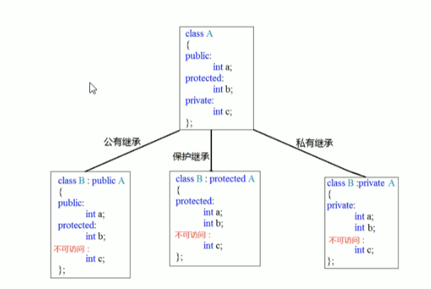

### 继承

- 公共继承
- 保护继承
- 私有继承



继承会继承父类所有的成员信息，包括private的属性，但private成员只是被隐藏了

#### 继承中的构造函数和析构函数

先构造父类，再构造子类，先析构子类，再析构父类

#### 同名成员属性处理

```c++
class Base(){
public:
    int a;
    Base(){this->a=100;}
    static int b;  // 静态属性，类内定义，类外赋值
    void func(){};
}
int Base::b=100;

class Son(){
public:
    int a;
    Son(){this->a=100;}
    static int b;
    void func(){};
}
int Son::b=100;

// 测试
Son s;
cout<<s.a<<endl;         // 输出s对象自己的a
cout<<s.Base::s.a<<endl; // 在Base作用域下，输出父类的a

// 通过对象访问静态属性
cout<<s.b<<endl;
cout<<s.Base::b<<endl;
// 通过类名访问静态属性
cout<<Base::b<<endl;
cout<<Son::Base::b<<endl;

// 访问函数同理
cout<<s.func()<<endl;
cout<<s.Base::func()<<endl;
```

#### 多继承

```c++
class Son : public Base1,public Base2,...
```

不同父类出现同名成员，需要加作用域

#### 虚继承

羊 和 驼 继承于Animal，羊驼继承于 羊 和 驼 两个类（称为菱形继承）。羊、驼、Animal类都有`int age`属性。此时使用虚继承可以让羊驼类只有一个age属性，**防止出现二义性**。

```c++
class Sheep : virtual public Animal{};
class Tuo : virtual public Animal{};
class YangTuo : public Sheep,public Tuo{};
```

#### 继承的构造函数

```c++
#include<iostream>
#include<string>
using namespace std;

class workers
{
private:
    
public:
    workers(int id,string sex,int age);
    string sex;
    int id;
    int age;
    static int b;
};
int workers::b=100;

workers::workers(int id,string sex,int age)
{
    this->age=age;
    this->id=id;
    this->sex=sex;
}

class Teachers : public workers
{
public:
    int curriculum;
    void showInfo(){
        cout<<"Teacher:"<<this->id<<"\t"<<this->sex<<"\t"<<this->age<<endl;
        cout<<"Curriculum:"<<this->curriculum<<endl;
    }
    // 继承的构造函数
    // 要按顺序来定义参数，且参数名称要和父类workers一样
    Teachers(int id,string sex,int age,int curriculum) : workers(id,sex,age){
        this->curriculum=curriculum;
    }
};

int main(){
    Teachers t(10,"male",29,1001);
    t.showInfo();
    return 0;
}
```

