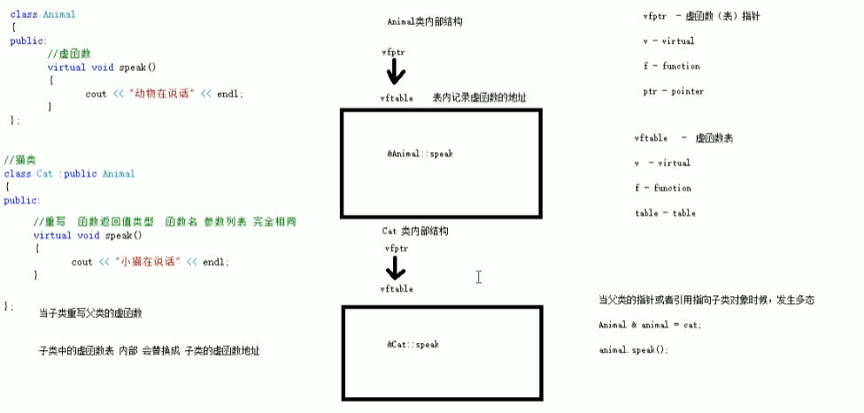

### 多态

多态分为两类

- 静态多态：函数重载、运算符重载等，复用函数名
- 动态多态：派生类(父类)的虚函数实现**运行时**多态

区别

- 静态多态的函数地址早绑定——**编译阶段**确定函数的地址
- 动态多态的函数地址晚绑定——**运行阶段**确定函数地址

##### 动态多态的满足条件

1. 有继承关系
2. 子类重写父类的虚函数

##### 动态多态的使用

父类的指针或者引用，执行子类对象

##### Example

```c++
#include<iostream>
using namespace std;

class Animal
{
public:
    // 虚函数，实现多态的方法
    virtual void func(){
        cout<<"Animal"<<endl;
    }
};

class Cat : public Animal
{
public:
    void func(){
        cout<<"Cat"<<endl;
    }
};
class Dog : public Animal
{
public:
    void func(){
        cout<<"Dog"<<endl;
    }
};
// 引用，然后根据传入的对象类型，调用对应的func()函数；若不加地址引用，则是值引用，调用的是Animal的func()，因为在编译阶段，a.func()就已经指向Animal::func()
// 值引用可以看作，把cat的值赋给a的时候，没有把vfptr的值赋进去
void doSpeak(Animal &a){
    a.func();
}

int main(){
    Cat cat;
    Dog dog;
    cat.func();   
    dog.func();
    doSpeak(cat);
    return 0;
}
```

##### 动态多态原理



Animal的speak不是虚函数时，sizeof(Anima)=1；当virtual speak后，sizeof(Anima)=4

原因是，Animal内部多了一个指向虚函数表的指针vfptr，当子类重写父类虚函数的时候，**子类中的虚函数表**中的内容会替换成子类的虚函数的地址。


#### 纯虚函数 和 抽象类

只要有一个纯虚函数，这个类称为抽象类

抽象类特点：

1. 无法实例化对象
2. 抽象类的子类必须重写父类中的纯虚函数，否则也属于抽象类

```c++
// 抽象类
class AbstractClass
{
public:
    // 纯虚函数
    virtual void func() = 0;
}

class Son
{
public:
    // 重写父类的纯虚函数
    virtual void func() {
        ...
    };
}
```

